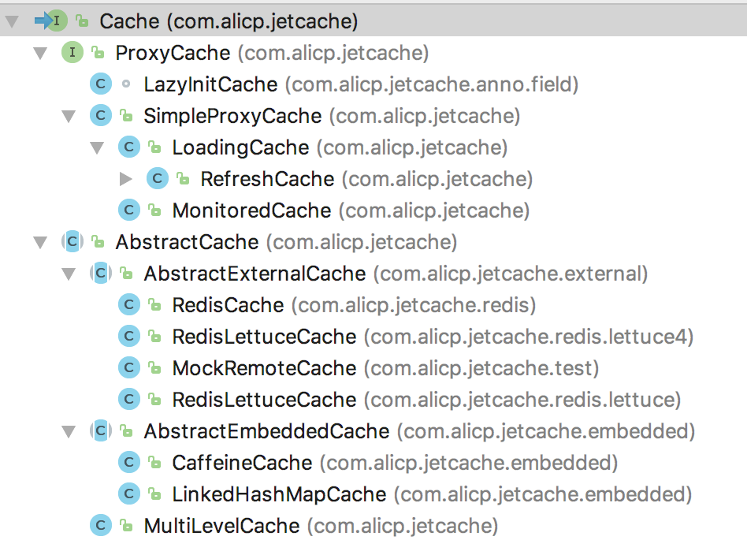

# 开发环境配置
clone下来以后，可以按maven项目导入idea或eclipse。


# 单元测试配置
跑通单元测试，需要在本地运行redis，先安装docker。

如果使用命令行或Linux，请参考源代码根目录下的building.txt，这样会运行最完整的单元测试。

如果使用Windows或者Mac开发，并且想在IDE里面运行，先用下面的命令运行redis + sentinel：
```
docker run --rm -it -p 6379-6381:6379-6381 -p 26379-26381:26379-26381 areyouok/redis-sentinel
```
然后就可以在IDE中运行测试（不包括redis cluster的测试）。

在IDE里面，可能还需要给javac设置-parameters参数。

需要注意的是机器繁忙时单元测试有可能会失败，因为很多单元测试使用了sleep，为了不让单元测试运行的时间过长，sleep的时间都设置的比较短，这样机器卡顿时可能导致检查失败，不过对于正常机器这并不经常发生。

运行所有的单元测试可能需要几分钟。

# 源代码阅读
jetcache分为两部分，一部分是Cache API以及实现，另一部分是注解支持。

Cache接口是核心接口，它提供统一的缓存操作API，可以查看类继承结构了解哪些类实现了该接口，重要的有：
* RedisCache: redis实现，使用jedis客户端
* RedisLettuceCache： redis实现，使用lettuce客户端
* CaffeineCache: 基于内存的缓存，使用Caffeine
* LinkedHashMapCache: 自制的简易内存缓存，没有任何依赖
* LoadingCache：基于Decorator模式，提供自动加载功能
* RefreshCache：基于Decorator模式，提供自动刷新功能
* MultiLevelCache：多级缓存，注解方式配置只支持了两级，实际上这个类支持N级



jetcache-anno提供了注解支持，顺着这两个注解类看就可以了：
* EnableCreateCacheAnnotation
* EnableMethodCache

Spring Boot方式的配置支持都在jetcache-starter里面。


# 修改版本号以便发布自己的snapshot版本
```
mvn versions:set -DnewVersion=x.x.x-SNAPSHOT
```