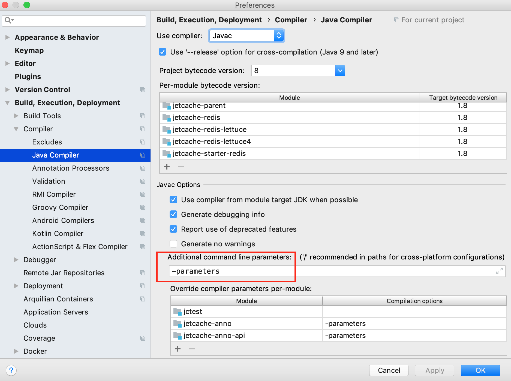
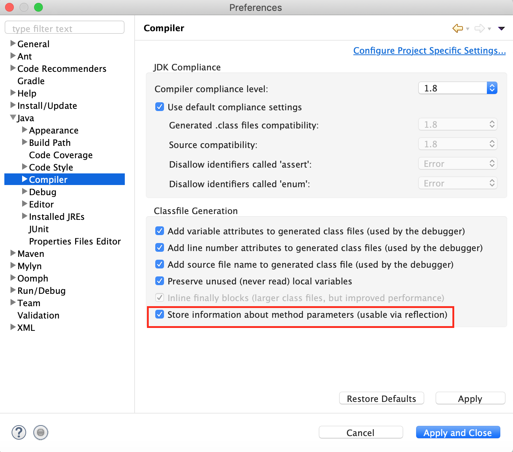

## 为什么调用同一个类的另一个方法，```@Cached```注解没有生效？
JetCache的注解功能是使用Spring AOP来实现的，而Spring基于Proxy来实现AOP。
从Spring Context中获得的bean，以及通过```@Autowired```注解都是代理增强过的，所以可以织入缓存相关的逻辑，同一个类中通过this调用另一个方法，不经过代理，所以JetCache的缓存逻辑以及Spring的其它AOP切面都不会生效。

JetCache暂未支持AspectJ。

一个替代方法是，在bean中通过```@Autowired```注入它自己，然后在用注入的实例代替this来调用。

## @Cached的key、condition等表达式中使用参数名以后缓存没有生效
javac编译器需要指定-parameters参数以后才会把参数名信息写入到字节码中，然后才能被反射机制读取，默认情况下这个参数是没有指定的。

pom中的指定方式：
```xml
<plugins>
    <plugin>
        <groupId>org.apache.maven.plugins</groupId>
        <artifactId>maven-compiler-plugin</artifactId>
        <version>3.7.0</version>
        <configuration>
            <source>1.8</source>
            <target>1.8</target>
            <compilerArgument>-parameters</compilerArgument>
        </configuration>
    </plugin>
</plugins>
```
如果你在IDE中运行程序，光在pom中指定还不够。

在IntelliJ IDEA中设置：


在Eclipse中设置：


## 如何定制自己的序列化器
在Cached和CreateCache上的serialPolicy可以指向一个Spring Bean。
做一个类实现SerialPolicy接口，在Spring Context中创建该类的实例（假设名字为myBean），在Cached和CreateCache注解上设置serialPolicy="bean:myBean"即可。

更进一步，如果想把自定义的序列化器设置为默认的，实现一个EncoderParser（继承DefaultSpringEncoderParser修改即可），然后做成一个bean放到 spring context中。

## 我想要JSON序列化器
jetcache老版本中是有两个序列化器的：java、kryo。jetcache2.7增加了kryo5、fastjson2、jackson。
现在默认的序列化器是性能最差，但是兼容性最好，大家也最熟悉的java序列化器。

json不是一个专门的java序列化库，更多的时候是用来和前端进行数据交互，前端传入的
不受信任的json字符串如果随便就反序列化，会造成极其严重的安全问题，为了避免这些问题各个json类库都变得极为保守，
只要反射无法识别类型（比如字段类型是Object实际上是XxxBean），就会反序列化为JSONObject，这样反序列化的兼容性就变得很差。

因此fastjson2和jackson这两个json序列化器默认是没有注册的，如果要使用请自行做好相关的配置和改动。
如果你不知道该怎么注册，建议不要用json序列化器，因为json反序列化出了问题你也搞不定的。

