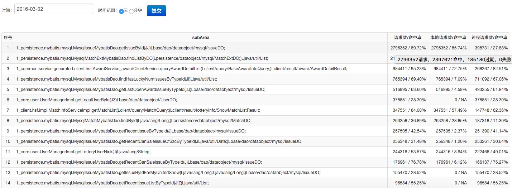

## 简介
JetCache是一个和Spring Cache类似的，基于超时的通用缓存框架，当数据更新时，不处理缓存的update/delete，靠超时淘汰。

为什么不处理缓存的更新呢？
> * 第一，因为一致性无法保证。缓存和数据库同时更新其实是一个分布式事务，很难保证一致，基于超时去淘汰，至少能做到最终一致性。
> * 第二，因为缓存的更新非常麻烦。一个获取用户订单列表的方法，传入的参数是用户id，一个更新用户订单的方法，传入的参数是订单对象。实际上一个订单更新以后，无数查询视图都需要更新（如果有缓存的话），很难通过条件指定要失效那些缓存。

Spring致力于提供一个通用的缓存抽象，而jetcache只定位在一个细分的领域希望能够做到更好。实际上jetcache从spring cache中借鉴了很多东西。

### 特性
> * 透明的缓存机制，不需要对业务代码进行改动（与Spring相同）
> * 可以使用不同的缓存实现（与Spring相同）
> * 支持条件缓存（与Spring相同），并且在条件表达式用可以访问Spring bean
> * 提供了注解和API两种声明和使用缓存的机制（Spring主要是基于注解）
> * 内置TTL（缓存超时时间）的支持（Spring没有而是丢给了实现去做，这样用起来会很麻烦）
> * 支持缓存上下文，方法提供者声明缓存但默认不打开，由使用者决定是否打开（Spring没有）
> * 默认提供了适用于绝大部分情况的的高效KEY生成策略和Value序列化机制（Spring的默认KEY生成机制没法用，3.1使用hashCode，4.0依赖toString）
> * 支持本地和远程两级缓存（Spring没有）
> * 对于没有配置缓存的方法，调用者可以自己声明缓存（Spring没有）

## 基本使用
### maven依赖
```xml
<dependency>
    <groupId>com.taobao.geek.jetcache</groupId>
    <artifactId>jetcache-spring</artifactId>
    <version>1.0.1</version>
</dependency>
<dependency>
    <groupId>com.taobao.geek.jetcache</groupId>
    <artifactId>jetcache-ali</artifactId>
    <version>1.0.1</version>
</dependency>
```
| groupId | artifactId | 最新版本 | 描述 |
| --- | --- | --- | --- |
| com.taobao.geek.jetcache | jetcache-api | 1.0.1 | 注解等api，无传递性依赖 |
| com.taobao.geek.jetcache | jetcache-core | 1.0.1 | 核心类库和默认的LocalCache实现。依赖jetcache-api、fastjson（K、V生成）、mvel（条件表达式）、KRYO（默认Value序列化方式） |
| com.taobao.geek.jetcache | jetcache-spring | 1.0.1 | spring集成，依赖jetcache-core、spring（provided） |
| com.taobao.geek.jetcache | jetcache-ali | 1.0.1 | 集成阿里内部组件，依赖jetcache-core、tair（provided） |
### 基本使用
```java
 public interface UserService{
     @Cached(expire = 3600)
     public User getUserById(long userId);
 }
```
服务方通过注解添加了缓存，调用方不需要任何修改即可享用。参数可以是多个，也可以是复杂对象（JavaBean），jetcache会根据所有参数拼出KEY。
### 更多参数
```java
 public interface UserService{
     @Cached(area="A2",expire=3600,cacheType=CacheType.BOTH,localLimit=50)
     public User getUserById(long userId);
 }
```
### Spring配置
Spring配置文件样例如下，JetCache会自动扫描base-package指定的包下的注解
```xml
<beans xmlns="http://www.springframework.org/schema/beans" xmlns:xsi="http://www.w3.org/2001/XMLSchema-instance"
       xmlns:jetcache="http://www.alibaba.com/schema/jetcache"
       xmlns:context="http://www.springframework.org/schema/context"
       xsi:schemaLocation="http://www.springframework.org/schema/beans
       http://www.springframework.org/schema/beans/spring-beans.xsd
        http://www.springframework.org/schema/context
        http://www.springframework.org/schema/context/spring-context-3.0.xsd
        http://www.alibaba.com/schema/jetcache
        http://www.alibaba.com/schema/jetcache/jetcache.xsd">
    <context:annotation-config/>
    <context:component-scan base-package="com.taobao.yourpackage"/>
 
    <!--扫描@Cached注解-->
    <jetcache:annotation-driven base-package="com.taobao.yourpackage"/>
 
    <bean id="globalCacheConfig" class="com.taobao.geek.jetcache.spring.SpringGlobalCacheConfig">
        <constructor-arg index="0">
            <map>
                <!--key与area对应-->
                <entry key="" value-ref="defaultCacheProvider"/>
                <entry key="A1" value-ref="cacheProvider2"/>
            </map>
        </constructor-arg>
        <property name="cacheMonitor">
            <!--cacheMonitor是可选的，使用AliJetCacheMonitor这个类会在/home/admin/logs/eagleeye下生成stat-jetcache.log文件进行统计，
                   并用使用debug级别输出每次访问cache的日志，你也可以实现自己的monitor-->
            <bean class="com.taobao.geek.jetcache.ali.monitor.AliJetCacheMonitor">
                <property name="appName" value="yourAppName" />
            </bean>
        </property>
    </bean>
    <bean id="defaultCacheProvider" class="com.taobao.geek.jetcache.support.CacheProvider">
        <property name="remoteCache">
            <bean class="com.taobao.geek.jetcache.tair.TairCache">
                <property name="namespace" value="465"/>
                <property name="tairManager" ref="tairManager">
            </bean>
        </property>
        <!--localCache使用默认的就好了，通常不用配置-->
    </bean>
    <bean id="cacheProvider2" class="com.taobao.geek.jetcache.support.CacheProvider">
        <property name="remoteCache">
            <bean class="com.taobao.geek.jetcache.tair.TairCache">
                <property name="namespace" value="466"/>
                <property name="tairManager" ref="tairManager">
            </bean>
        </property>
    </bean>
</beans>
```
### 更多@Cached属性
|属性|用途|默认值|详述|
|---|---|---|---|
|area|指定缓存存放的区域|“”|指定缓存的区域，在配置的时候，可以为不同的区域配置不同的缓存实现。比如A1区是Tair，而A2区是EHCache。在缓存实现相同的情况下，也可以用area做区域隔离。|
|expire|缓存超时时间|600|以秒为单位的超时时间|
|cacheType|缓存的类型|CacheType.REMOTE|CacheType.REMOTE表示使用远程（不在JVM进程内）缓存系统，value对象通过特定的方式编码（由缓存的实现来定义），然后传递到远程系统。CacheType.LOCAL表示使用本地的缓存系统，本组件集成了一个默认的本地缓存实现。CacheType.BOTH表示使用二级缓存，先在本地缓存查找，如果找不到就到远程查找，两者都没有找到，则调用原来的方法，并且会同时更新本地和远程的缓存。|
|localLimit|本地缓存最大元素限制|100|以方法为单位的本地缓存最大元素限制，如果超出，实现应该按LRU算法进行淘汰。对CacheType.REMOTE无效。|
|version|cache版本号|1|有的时候因为程序的变动，我们想要让以前的Cache失效，这个时候可以通过变更版本号来达到目的，目前的实现会将版本号编码到KEY中。|
|enabled|缓存是否激活|true|有的时候，同一个方法X，A调用者需要使用缓存，而B调用者不希望有缓存。所以可以在这个方法上配置缓存，但是设置enabled为false，方法A调来用X的时候，通过代理或线程上下文激活缓存，而B调用者不需要修改。|
|cacheNullValue|是否缓存空值|false|当调用的方法返回空值的时候是否要缓存|
|condition|条件缓存|“”|如果指定，表达式为true则<font color=red>缓存</font>。例如@Cached(condition = "mvel{args[0]>0}")，在spring环境下可以通过bean方法访问spring bean，例如@Cached(condition = "mvel{bean('configBean').enableUserCache}")|
|unless|条件缓存|“”|如果指定，表达式为true则<font color=red>不缓存</font>。unless的表达式判定在方法调用之后，因此可通过内置变量result访问方法的返回值。例如@Cached(condition = "mvel{result<=0}")|
|serialPolicy|使用远程缓存时的序列化策略|KRYO|KYRO（默认）、FASTJSON、JAVA|

## KEY、VALUE策略
### KEY生成策略
类名+方法名+参数类型+所有参数（使用fastjson反射JavaBean） 如果方法有的入参不是支持的简单类型（原始类型、String、Date、List、Map等）也不是JavaBean（即有效条件没有getter或setter方法），那么结果可能会不正确。
### VALUE序列化策略
由Cache的实现者来决定，对于LOCAL类型的Cache，不需要序列化。对于REMOTE类型，则需要。

Tair实现也使用了KRYO（默认）、fastjson来做序列化。

TODO：如果value的结构发生变更，比如增加了字段，缓存应该失效。但这并不能防止这样的情况：IssueDO上没有增加字段，但是发布以后，同一个方法的新版本比老版本多返回了几个字段（比如原来只有issueId和issue，新版本多返回startTime），这缓存中的数据就是缺失一些字段的了，也应该失效，可惜这种情况程序无法知晓，还是只能让人来干预。

## 高级
### 命中率统计
通过stat-jetcache.log，使用tlog收集，可以统计每个区的命中率情况，例如


### 由调用者决定是否打开服务方提供的缓存
服务方配置缓存但是默认并不启用：
```java
 public interface UserService{
     @Cached(enabled=false)
     public User getUserById(long userId);
 }
```
这样，这个方法的调用默认不会被缓存。调用方如果需要缓存，就自己打开：
```java
@EnableCache 
public void bizMethod(){
    User user = userService.getUserById();
}
```
enableCache实际上是在当前线程上绑定一个变量，提示要使用缓存，因此如果开了新线程就无效。

也可以通过api的方式来激活缓存：
```java
CacheContext.enableCache(new Callback(){
    public void execute(){
        User user = userService.getUserById();
        //...
    }
});
```
execute方法如果需要返回一个值，可以这样：

```java
CacheContext.enableCache(new ReturnValueCallback(){
    public Object execute(){
        User user = userService.getUserById();
        //...
        return xxx;
    }
});
```
注意，enableCache并没有缓存execute方法的返回值，它只是在execute方法执行的时候，在当前线程上设置了激活缓存的标识，如果execute方法中调用了标注了@Cached(enabled=false)的方法，将会激活这个方法的缓存。

如果getUserById方法是个远程调用（HSF），目前还不支持把这个context传递到远程去。

### 调用方进行缓存
即使服务的提供者没有缓存（服务方法上没有@Cached注解），调用者也可以自己做缓存。比如service层的一个方法没有做缓存，调用方web层自己来做缓存。在这种情况下，由web层将缓存put到tair，如果使用本地缓存，会缓存到web层的内存中。
```java
 UserService userService = ...；
 CacheConfig cc = new CacheConfig();
 cc.setExpire(200);
 User user = cacheClient.getProxy(userService,cc).getUserById(userId);
```
关于上面代码中cacheClient的配置见下文。

### 使用api进行配置
jetcache的api都在com.taobao.geek.jetcache包和com.taobao.geek.jetcache.support包下，com.taobao.geek.jetcache.impl下的类都是内部使用的，请不要使用。

#### CacheClient
CacheClient类用来生成代理，它需要注入一个GlobalCacheConfig实例。

public <T> T getProxyByAnnotation(T target) 用来生成一个target对象的代理（目前是基于接口的代理）。jetcache会分析target.getClass()上面的所有方法上的注解，包括该类实现的接口上的注解，然后按配置返回代理对象。

public <T> T getProxy(T target, CacheConfig cacheConfig) 用来生成一个target对象的代理（目前是基于接口的代理），这个方法不需要target.getClass()上有任何注解，因为缓存相关的配置由第二个参数传入，所有的方法都会被代理。

#### CacheContext
CacheContext用来对Cached(enabled=false)的配置起到激活作用，前面已经有介绍。

## FAQ和注意事项

 > *  注解写在HSF接口上的时候，在调用方出现AopException:Could not generate CGLIB subclass ... Cannot subclass final class ...  这个原因是HSFConsumerBean使用了JDK的proxy来生成代理，而JDK生成的proxy是个final class，如果此时JetCache所在的Spring容器配置了proxy-target-class="true"，那么Spring会使用CGLIB（继承）来做AOP。解决办法有两个，一个是设置proxy-target-class="false"，另外一个是将注解写到HSF的实现类上，这样服务的调用方不会激活JetCache缓存。

 > *  注意参数里面有时间戳的就不要缓存了，肯定命中不了的

 > * 参数里面有特别复杂的Bean对象不要用jetcache缓存，Tair对KEY是有长度限制的

## TODO

> * 缓存失效时的保护策略
> * 性能优化
   * 使用ASM优化缓存的调用代码，减少反射调用，达到编译级别的性能
   * 添加内置的简易表达式解析器，在表达式比较简单的情况下达到编译级别的性能，同时也可以降低对MVEL的依赖（降为可选）
> * HSF支持，线程上的激活Cache的标识能够传递到远程去。(暂无计划，做了也是个坑)
> * Spring EL支持，是否需要？